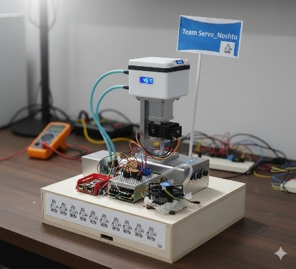
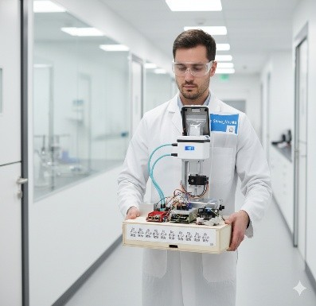
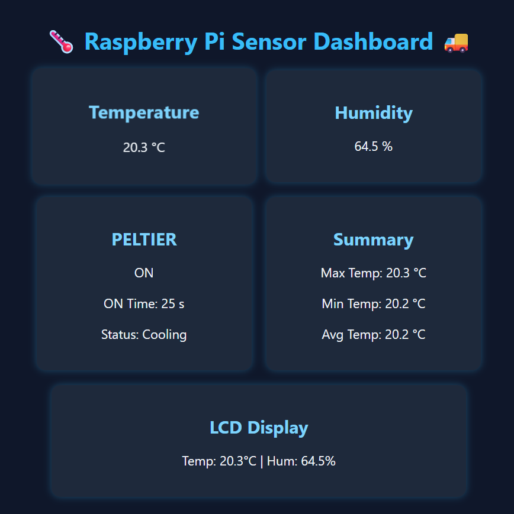

# Auto-Balancing-Climate-Controlled-Chest
Elelctronics lab project aimed to to balance itself automatically and give precise climate control. Vision is to make medicine delivery system more efficient and reduce coldchain failure

  
  

# Main Features:
## 1. Dual-Axis Stabilization:
MPU6050 senses movement; Raspberry Pi corrects tilt via MG996R servos through PCA9685 to keep the platform balanced.
## 2.Temperature & Humidity Regulation:
DHT22 continuously monitors conditions. The Peltier module cools or heats as required, supported by a fan for heat dissipation.
## 3.Data Display & Wireless Monitoring:
Real-time data is shown on the LCD and transmitted wirelessly to smartphones or cloud for IoT-based observation.

  

## 4.Optimized Power Management:
The Peltier activates only when needed, reducing energy waste and maintaining safety and sustainability.

# Working Principle:
🎬 [Watch Final Demo Video](https://youtu.be/2Oe_pmBS55Q)
🎬 [Watch First Demo Video](https://youtube.com/shorts/lRZPUXofp_E)

1. MPU6050 sends continuous tilt and motion data to Raspberry Pi.
2. Raspberry Pi calculates corrections and adjusts servos via PCA9685.
3. DHT22 measures temperature/humidity; the Pi controls Peltier and fan accordingly.
4. Data is logged locally and wirelessly shared for monitoring.
5. Alerts are generated when readings exceed safe limits.

# Applications:
Medical logistics (vaccines, blood, organs), research labs, defense, and industrial transport requiring vibration-free and controlled environments.

# Meet the team : Team Servo Noshto

  

